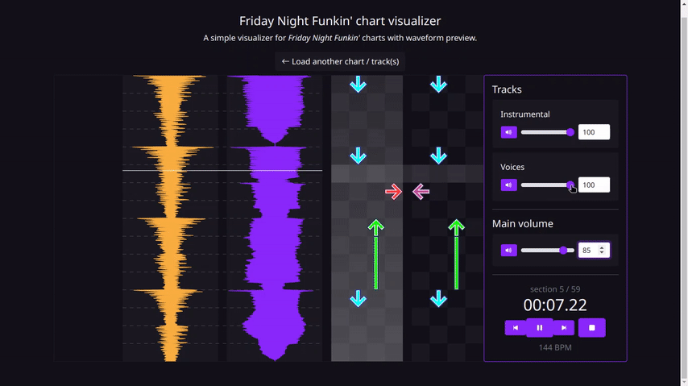
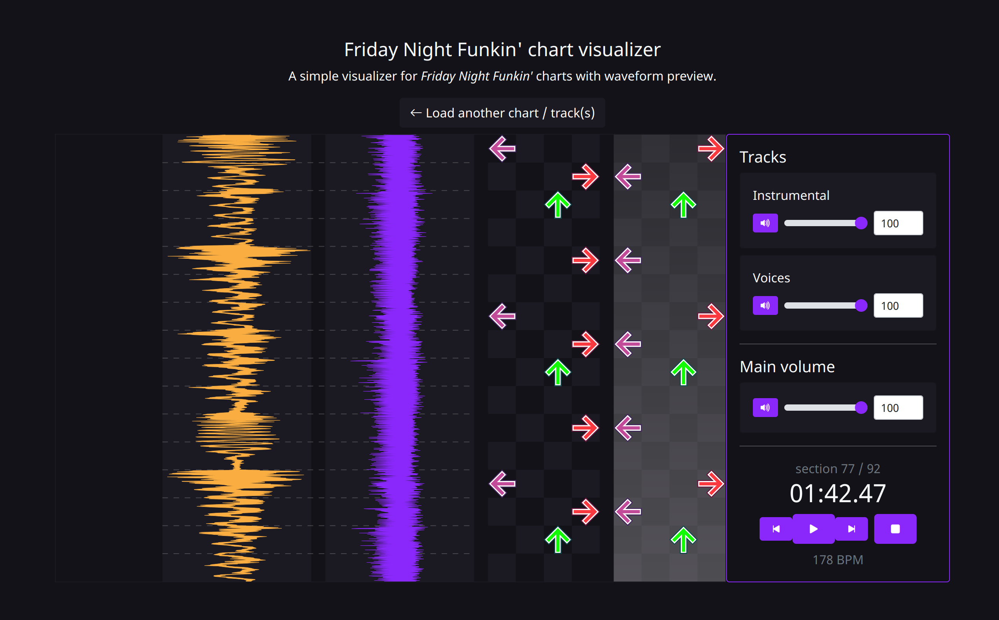

# Funkin' Web Chart
This is a standalone web app that displays Friday Night Funkin' charts along with audio waveforms to verify the sync of the arrows/notes to the music without any offset.

**This tool is not a chart editor in its current state, just a visualizer**.

## Features
 - Display two audio waveforms: instrumental and voices.
 - Audio playback and mixing with volume control of each track.
 - Users can upload charts and music tracks.
 - High DPI support for high resolution screens (experimental, useful for detailed waveforms).

This project includes all charts and music up until to Week 7 as examples.

## Preview





## Known issues

The schema of JSON chart files are not validated.
Dynamic BPM charts have not been fully tested.

## Run locally
Clone the project

```bash
git clone https://github.com/jsm925/FunkinChart
```

This is just a static web page, you can run it locally with any simple web server like Python's 'SimpleHTTPServer', node.js, nginx, etc.
I mostly use a [node.js static web server](https://github.com/http-party/http-server#readme):

```
http-server -p PORT
```

(`PORT` could be any HTTP port available for development like 5000, 3000, etc.)

You might need to download this external library to open the page offline:
https://github.com/bbc/waveform-data.js

## Friday Night Funkin' credits

This project uses up until *Week 7* assets of the game, so [play the game in Newgrounds](https://www.newgrounds.com/portal/view/770371)!

 - [ninjamuffin99](https://twitter.com/ninja_muffin99) - Programming
 - [PhantomArcade3K](https://twitter.com/phantomarcade3k) and [Evilsk8r](https://twitter.com/evilsk8r) - Art
 - [Kawai Sprite](https://twitter.com/kawaisprite) - Music
